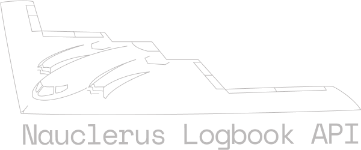
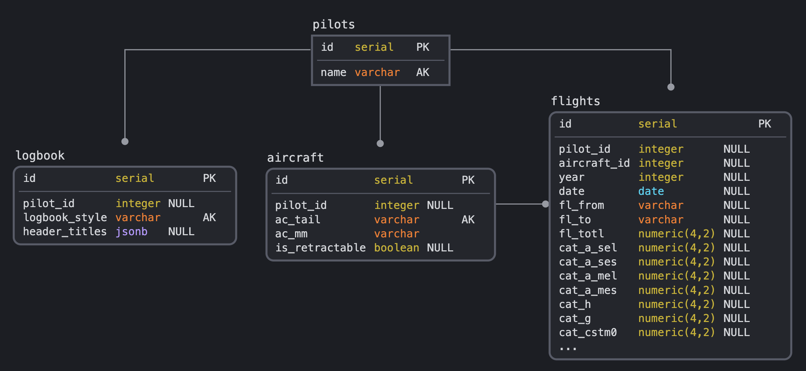

<!-- PROJECT LOGO -->
<br />
<p align="center">
  <a href="https://github.com/Daniel-Fernandez-951/GA-Pilot-Logbook">
    
  </a>

  <h3 align="center">General Aviation Pilot Logbook API </h3>

-----------------------

<!-- TABLE OF CONTENTS -->
<details open="open">
  <summary>Table of Contents</summary>
  <ol>
    <li>
      <a href="#about-nauclerus-logbook-api">About Nauclerus Logbook API</a>
      <ul>
        <li><a href="#database-diagram">Database Diagram</a></li>
        <li><a href="#built-with">Built With</a></li>
      </ul>
    </li>
    <li>
      <a href="#getting-started">Getting Started</a>
      <ul>
        <li><a href="#installation">Installation</a></li>
          <ul>
            <li><a href="#data-storage-options">Data Storage Options</a></li>
          </ul>
      </ul>
    </li>
    <li><a href="#usage">Usage</a></li>
    <li><a href="#roadmap">Roadmap</a></li>
    <li><a href="#license">License</a></li>
    <li><a href="#known-issues">Known Issues</a></li>
  </ol>
</details>

------------------------------

<!-- ABOUT THE PROJECT -->
## About Nauclerus Logbook API

**API endpoint for general aviation, rotorcraft and commercial pilots to store their logbook data**. Nauclerus runs in a Docker container,
allowing secure **local** access and redundant storage using NAS device that supports running Docker containers. Nauclerus can
also send your logbook data to a cloud service, ensuring there's always a backup of your logbook (at the cost of security for data redundancy).

### Database Diagram
Relational SQL database schema and relationships (_subject to change_):
<p align="center">
    

### Built With
For more details, checkout [requirements.txt](https://github.com/Daniel-Fernandez-951/GA-Pilot-Logbook/blob/master/requirements.txt) file.

* [FastAPI](https://fastapi.tiangolo.com/)
* [Pydantic](https://pydantic-docs.helpmanual.io/)
* [SQLAlchemy](https://docs.sqlalchemy.org/)
* [Numpy](https://numpy.org/doc/)
* [Pandas](https://pandas.pydata.org/)


<!-- GETTING STARTED -->
## Getting Started

Instructions for running the Dockerfile locally. 

:question: Running this on a NAS device (Synology or QNAP), please refer
to NAS distributor documentation for running Nauclerus API on your device.

### Installation

Depending on your choice in this section <a href="#datastorageoptions">Data Storage Options</a>; either configure
a remote database (the cloud) or save the database file locally. 

* **You decide** <a href="#datastorageoptions">Data Storage Options</a>!
* Navigate to the repository on your local machine and open a terminal window in that directory
  ```sh
  docker build -t <foo> . && docker run -p 80:80 -it <foo>
  ```
  - Replace `<foo>` with your desired container name, like `thanks-daniel`.

<!-- DATA STORAGE OPTIONS -->
#### Data Storage Options
* **Local Storage**: 
  - Change `/app/sqlUtils/database.py`
    ```python
    from os import getenv
    from dotenv import load_dotenv
    from sqlalchemy import create_engine
    from sqlalchemy.orm import sessionmaker
    from sqlalchemy.ext.declarative import declarative_base
    
    load_dotenv()
    
    SQLALCHEMY_DATABASE_URL = getenv('HEROKU_SQL_DB')
    
    engine = create_engine(
        SQLALCHEMY_DATABASE_URL,
        connect_args={"check_same_thread": False}
    )
    
    SessionLocal = sessionmaker(
        autocommit=False,
        autoflush=False,
        bind=engine
    )
    
    Base = declarative_base()
    ```
    - Create `/.env` file
    - ```dotenv
      HEROKU_SQL_DB=sqlite:///./sql_app.db
      ```
      Change `sql_app.db` to any file name you'd like!
  


* **Cloud Database Storage**:
  - Confirm `/app/sqlUtils/database.py` looks like this:
    ```python
    from os import getenv
    from dotenv import load_dotenv
    from sqlalchemy import create_engine
    from sqlalchemy.orm import sessionmaker
    from sqlalchemy.ext.declarative import declarative_base
    
    load_dotenv()
    
    SQLALCHEMY_DATABASE_URL = getenv('HEROKU_SQL_DB')
    
    engine = create_engine(
        SQLALCHEMY_DATABASE_URL
    )
    
    SessionLocal = sessionmaker(
        autocommit=False,
        autoflush=False,
        bind=engine
    )
    
    Base = declarative_base()
    ```
  - Create `/.env` file
    
    :bangbang: _When copying URI from cloud provider, check (or change) preamble to `postgresql://`_
    
    - ```dotenv
      HEROKU_SQL_DB=postgresql://<USER>:<PASSWORD>@<HOST>:<PORT>/<DATABASE>
      ```
      Change values in `< >` to your setup (most have a preformatted URI).


<!-- USAGE EXAMPLES -->
## Usage

Once the Docker image is running, navigate to `localhost/docs` or `localhost/redoc` for API documentation with input capabilities.

Check back later for more information.


<!-- ROADMAP -->
## Roadmap

- [ ] Add an endpoint for uploading logbook in the following formats:
    - [ ] `.xls`
    - [ ] `.xlsx`
    - [ ] `.csv`
- [ ] Frontend for data entry
- [x] ~~Other Logbook styles (Professional and General Aviation)~~ Now has a general layout to accomidate all types and Logbook styles!
- [ ] `GET` endpoint for reports
- [ ] More `GET` and `POST` endpoints

Please suggest some features! This is a one human project (now), and new ideas welcomed to break any calcification.

<!-- LICENSE -->
## License

Distributed under GPL-3.0 License. See [LICENSE](https://github.com/Daniel-Fernandez-951/GA-Pilot-Logbook/blob/master/LICENSE) for more information.


<!-- Support -->
## Support
Support me by buying me 1/10 of a gallon of AvGas, so I can practice my taxiing:
* Stellar *XLM*: `GBLOUZQPCQXVQAJAHSM2PUEWKHJT5M3TAQ63LKT6KQCQPNI2X5MZSL23`

Or by suggesting features and pointing out any bugs.

**_Thank you!_**


<!-- KNOWN ISSUES -->
## Known Issues
- When connecting to *Heroku PostgresQL Datastore*:
    - `sqlalchemy.exc.NoSuchModuleError: Can't load plugin: sqlalchemy.dialects:postgres`
    
_Solution_: Navigate to `.env` file and change your database URI from `postgres://` --> `postgresql://`
